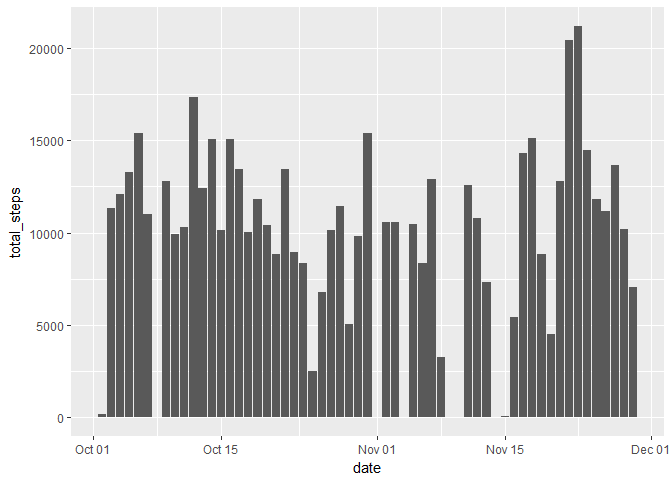
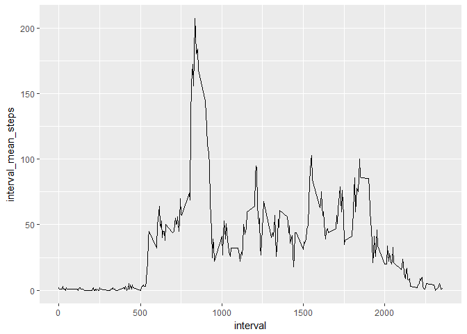
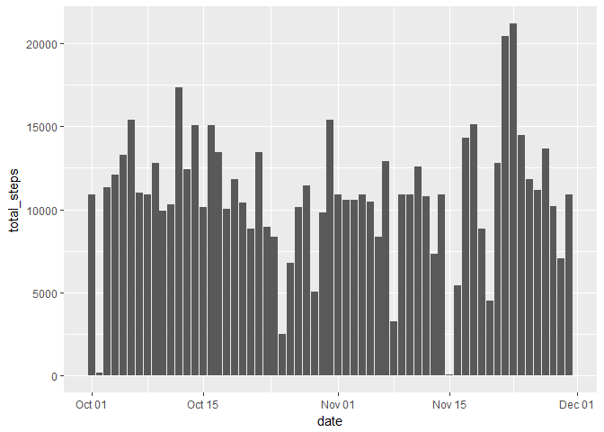
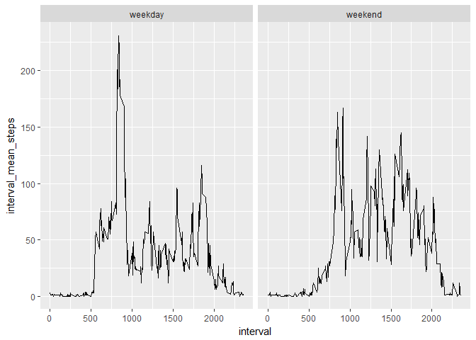

## Packages used in this assignment
R packages used in this assignment include: lubridate, dplyr, and lubridate. These packages should be installed in R before running the code in this document. 


```r
library(lubridate)
library(dplyr)
library(ggplot2)
```

## 1.Loading and preprocessing the data
Information contained in "activity.csv"" was loaded into a dataframe called "activity" using the read.table() R command. Subsequently, the column "date" was converted into the lubridate date format. 


```r
activity<-read.table("activity.csv", sep=",", header=TRUE)
activity$date <- ymd(activity$date)
```

## 2.What is mean total number of steps taken per day?
For this part of the assignment, we can ignore the missing value in the dataset. It is suggested that we first: 1) calculate the total number of steps taken per day; 2) make a histgram of the total number of steps taken each day; and 3) calculate and report the mean and median of the total number of steps taken per day. 

I have opted to use the dplyr functions to manipulate the data. The dataframe containing the info of the csv is first filtered to remove all observations whereby step count over a 5 min period was N.A. Thereafer the filtered dataset was grouped by date to 5-minute step count information to be summed into total steps per day format.  


```r
daily_step_summary <-activity %>% filter(!is.na(steps)) %>%
                        group_by(date) %>%
                          summarize(total_steps=sum(steps))
head(daily_step_summary)
```

```
## # A tibble: 6 x 2
##   date       total_steps
##   <date>           <int>
## 1 2012-10-02         126
## 2 2012-10-03       11352
## 3 2012-10-04       12116
## 4 2012-10-05       13294
## 5 2012-10-06       15420
## 6 2012-10-07       11015
```

A histogram is then plotted using the ggplot2 package.


```r
ggplot(data=daily_step_summary, aes(x=date, y=total_steps)) + geom_bar(stat="identity")
```

<!-- -->

The mean and median daily steps per day were obtained by a call to the r mean and median function over the total steps recorded per day information in the daily_step_summary dataframe.


```r
mean(daily_step_summary$total_steps)
```

```
## [1] 10766.19
```

```r
median(daily_step_summary$total_steps)
```

```
## [1] 10765
```

## 3.What is the average daily activity pattern?

Observations with N.A values for steps are first removed. In order to answer this question, the information now has to be grouped by interval (as oppose to date for the first question), and the mean step over each interval computed. 


```r
interval_step_summary<-activity %>% filter(!is.na(steps)) %>%
                          group_by(interval) %>% 
                            summarize(interval_mean_steps = ceiling(mean(steps)))

head(interval_step_summary)
```

```
## # A tibble: 6 x 2
##   interval interval_mean_steps
##      <int>               <dbl>
## 1        0                   2
## 2        5                   1
## 3       10                   1
## 4       15                   1
## 5       20                   1
## 6       25                   3
```

The ggplot2 package is then used to plot a line graph depicting the average steps during each 5-min interval over the entire duration in the course of a day where step information was available.


```r
ggplot(data=interval_step_summary, aes(x=interval, y=interval_mean_steps)) + geom_line()
```

<!-- -->

The 5-minute interval averaging the most steps is first identified by its index using the which.max() R function. The minute label of the 5-minute interval as well as the average number of steps corresponding to the indentified interval is retrieved using the index. 


```r
interval_step_summary$interval[which.max(interval_step_summary$interval_mean_steps)]
```

```
## [1] 835
```

```r
interval_step_summary$interval_mean_steps[which.max(interval_step_summary$interval_mean_steps)]
```

```
## [1] 207
```

## 4.Calculating number of missing values in the recorded data
Summing up the number of instance of "TRUE" returned by is.na() applied to the steps column of the data frame would give us the total number of N.A entries in the dataset. 


```r
sum(is.na(activity$steps))
```

```
## [1] 2304
```

## 5.Imputing missing values
Observations with missing step data in the dataset are to be imputed with the average number of steps for that 5-minute interval. The average number of steps for that interval has been computed in question 3 above.   

A quick way to perform the impute process is to:

1.filter out rows (observations) with N.A steps

2.perform a left join of the filtered data with average step count information by the "interval" which is the common id to both data sets. The joined dataframe is temporary, and
the step information in the "interval_mean_steps" column will be used to overwrite the N.A values in the activity_copy dataframe. 


```r
head(activity %>% filter(is.na(steps)) %>% left_join(interval_step_summary, by="interval"))
```

```
##   steps       date interval interval_mean_steps
## 1    NA 2012-10-01        0                   2
## 2    NA 2012-10-01        5                   1
## 3    NA 2012-10-01       10                   1
## 4    NA 2012-10-01       15                   1
## 5    NA 2012-10-01       20                   1
## 6    NA 2012-10-01       25                   3
```

```r
activity_copy<-activity

activity_copy$steps[is.na(activity$steps)] <- (activity %>% filter(is.na(steps)) %>% left_join(interval_step_summary, by="interval"))$interval_mean_steps
```

To create a histogram  of the total number of steps taken per day with the dataframe with n.a imputed, the imputed dataframe was first grouped by date and then summarized. The ggplot2 package geom_bar function was then called to create the historgram plot. 


```r
daily_step_summary_nafilled <-activity_copy %>%
                                group_by(date) %>%
                                  summarize(total_steps=sum(steps))

ggplot(data=daily_step_summary_nafilled, aes(x=date, y=total_steps)) + geom_bar(stat="identity")
```

<!-- -->

When compared with the history created with n.a data, the imputed history appeared smoother. However, the mean and median daily steps did not differ much between the imputed and non-imputed data. 


```r
mean(daily_step_summary_nafilled$total_steps)
```

```
## [1] 10784.92
```

```r
median(daily_step_summary_nafilled$total_steps)
```

```
## [1] 10909
```

## 6.Are there differences in activity patterns between weekdays and weekends?

In order to faciliate the creation of a panel plot, a factor variable consisting of 2 levels - "weekday" and "weekend" has to be first created. The method employed to create the factor variable in the activity dataframe is as follows:

1. using dplyr::mutate() and lubridate::wday(), a column of days of the week (e.g. mon, tues, wed ...) is created from the date information. 

2. An additional column labeling "Mon" to "Fri" as "weekday"", and "Sat" and "Sun" as "weekend" is created using mutate() with the if_else() condition assignment. The resulting column is a list of characters. 

3. the column data type is that converted into factor using as.factor()


```r
activity_copy_wdays<-activity_copy %>% mutate(day_of_week = wday(date, label=TRUE)) %>%
  mutate(day_class = if_else(day_of_week=="Sat"| day_of_week=="Sun", "weekend", "weekday"))

activity_copy_wdays$day_class <- as.factor(activity_copy_wdays$day_class)

head(activity_copy_wdays)
```

```
##   steps       date interval day_of_week day_class
## 1     2 2012-10-01        0         Mon   weekday
## 2     1 2012-10-01        5         Mon   weekday
## 3     1 2012-10-01       10         Mon   weekday
## 4     1 2012-10-01       15         Mon   weekday
## 5     1 2012-10-01       20         Mon   weekday
## 6     3 2012-10-01       25         Mon   weekday
```

```r
str(activity_copy_wdays)
```

```
## 'data.frame':	17568 obs. of  5 variables:
##  $ steps      : num  2 1 1 1 1 3 1 1 0 2 ...
##  $ date       : Date, format: "2012-10-01" "2012-10-01" ...
##  $ interval   : int  0 5 10 15 20 25 30 35 40 45 ...
##  $ day_of_week: Ord.factor w/ 7 levels "Sun"<"Mon"<"Tue"<..: 2 2 2 2 2 2 2 2 2 2 ...
##  $ day_class  : Factor w/ 2 levels "weekday","weekend": 1 1 1 1 1 1 1 1 1 1 ...
```

4. to prepare for the panel plot, the dataframe is first grouped by day_class (i.e whether its a weekday or weekend) and then by the 5-mins interval. ggplot2 is then used to create the line plot in 2 panels - one for weekday and one for weekend. 


```r
interval_step_summary_wday <- activity_copy_wdays %>% group_by(day_class, interval) %>% 
                                  summarize(interval_mean_steps = ceiling(mean(steps)))

ggplot(data=interval_step_summary_wday, aes(x=interval, y=interval_mean_steps)) + geom_line() + facet_grid(.~day_class)
```

<!-- -->
